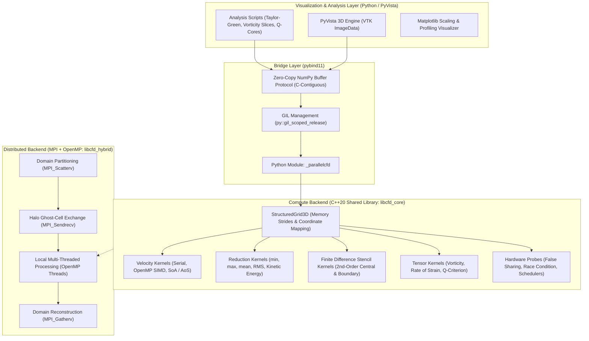
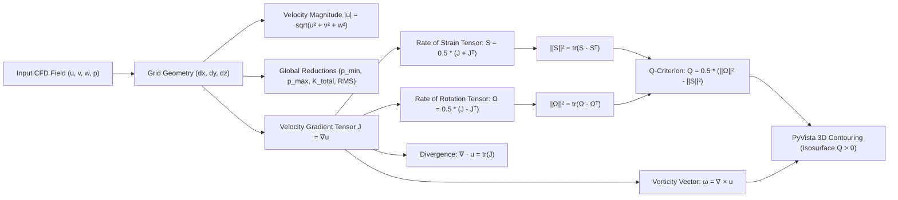
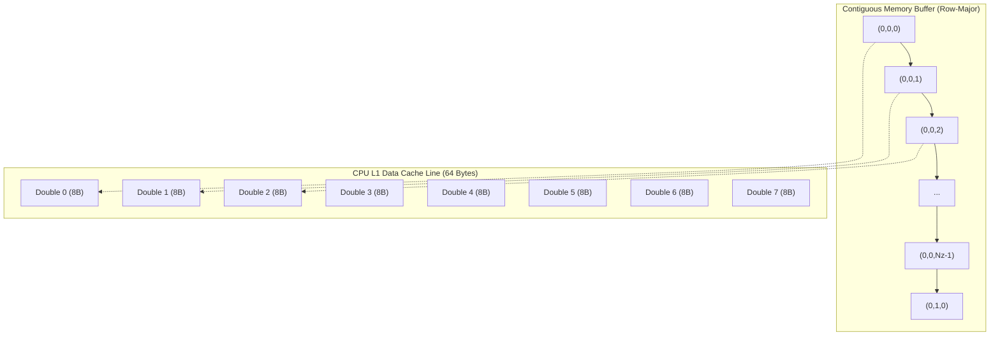
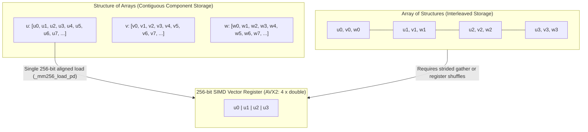
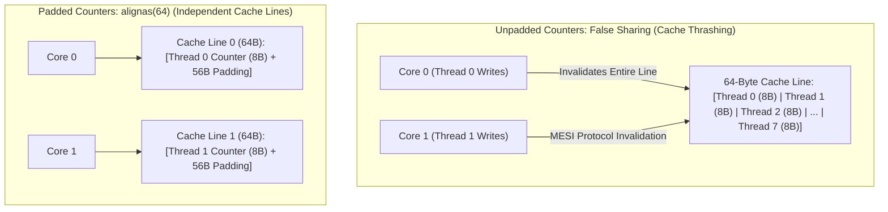
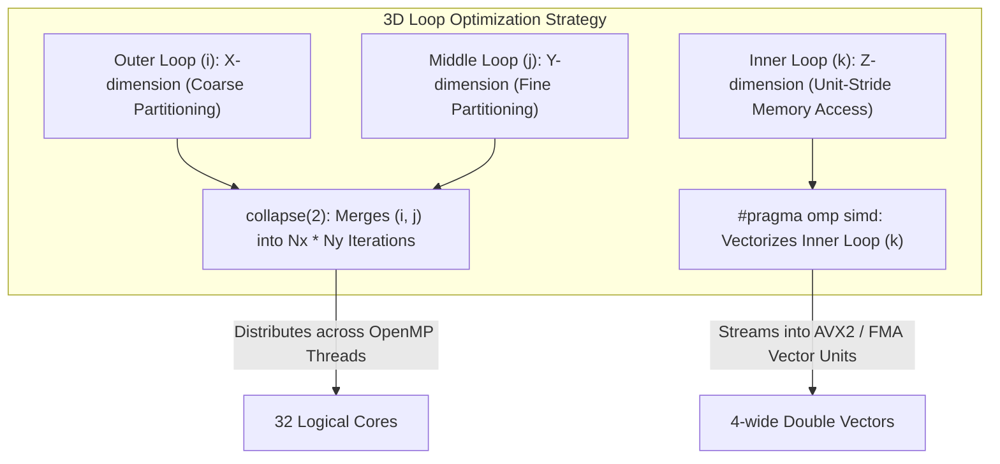
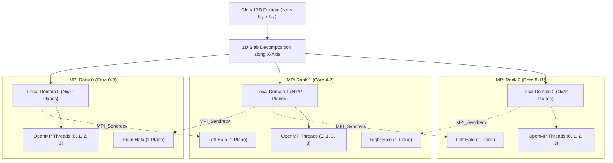
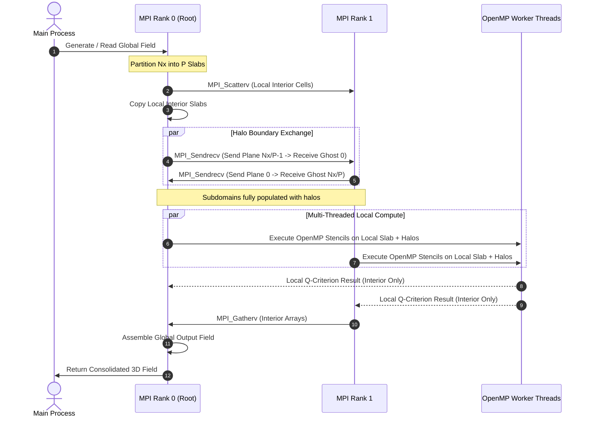
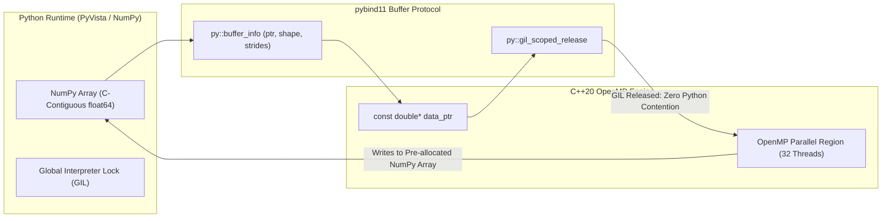

# ParallelCFD: System Architecture & Technical Design

**ParallelCFD** is a high-performance C++20 and OpenMP post-processing toolkit engineered for large-scale Computational Fluid Dynamics (CFD) datasets. This document details the software architecture, memory hierarchies, stencil discretization schemes, hybrid domain decomposition, and zero-copy Python interoperability.

---

## 1. High-Level System Architecture

The toolkit follows a layered architecture connecting high-level Python visualization with bare-metal C++20 multi-threaded kernels:



---

## 2. End-to-End Processing & Mathematical Pipeline

The post-processing pipeline transforms raw Cartesian flow fields into tensor invariants and vortex structures:



---

## 3. Memory Layout & Cache Hierarchy Optimization

### 3.1. Row-Major Stride-1 3D Storage

All 3D fields ($N_x \times N_y \times N_z$) are stored in continuous, flat memory buffers using C-contiguous row-major order:

$$\text{Index}(i, j, k) = (i \cdot N_y + j) \cdot N_z + k$$

$$\text{Stride}_x = N_y \cdot N_z, \quad \text{Stride}_y = N_z, \quad \text{Stride}_z = 1$$

This ensures that the innermost loop index ($k$) traverses consecutive memory addresses with unit stride ($\Delta = 8$ bytes for double precision), maximizing hardware prefetcher efficiency and enabling AVX2/AVX-512 SIMD vectorization.



---

### 3.2. Structure of Arrays (SoA) vs. Array of Structures (AoS)



- **AoS Limitation:** Accessing only $u$ requires striding over $v$ and $w$ ($24$ bytes per step). Loading into 256-bit SIMD registers requires cross-lane shuffle or gather instructions.
- **SoA Advantage:** $u$, $v$, and $w$ are completely separate contiguous vectors. Four consecutive values load directly into AVX2 registers with zero permutation overhead.

---

### 3.3. Cache-Line False Sharing & Hardware Padding



- In the unpadded layout, writes to adjacent thread counters trigger the **MESI cache-coherence protocol**, bouncing the cache line between cores and stalling the pipeline.
- Using `struct alignas(64) PaddedCounter { uint64_t val; char pad[56]; };` ensures each counter resides on a distinct cache line, delivering an empirical **$1.8\times$ speedup**.

---

## 4. Loop Nesting & OpenMP Collapse Optimization

For a 3D finite-difference loop over $N_x \times N_y \times N_z$:

```cpp
#pragma omp parallel for collapse(2) schedule(static)
for (size_t i = 0; i < nx; ++i) {
    for (size_t j = 0; j < ny; ++j) {
        #pragma omp simd
        for (size_t k = 0; k < nz; ++k) {
            // Stencil evaluations
        }
    }
}
```



- **`collapse(1)`:** Dispatches only $N_x$ chunks. If $N_x = 128$ and $p = 32$, each thread gets only 4 planes, causing potential imbalance.
- **`collapse(2)`:** Combines $(i, j)$ into $N_x \times N_y = 16,384$ iterations, distributing work evenly across all threads while keeping the innermost contiguous $k$-loop intact for SIMD vectorization.
- **`collapse(3)`:** Flattens all three loops, calculating $(i, j, k)$ via division/modulo or linear indices, which adds index calculation overhead and disrupts hardware prefetchers.

---

## 5. Hybrid MPI + OpenMP Architecture

### 5.1. Domain Decomposition & Halo Exchange



---

### 5.2. Communication Sequence Diagram



---

## 6. Zero-Copy Python / C++ Interoperability

The Python interface uses **pybind11** with zero-copy memory mapping:



1. **Zero-Copy Access:** `py::array_t<double>::request()` extracts the raw memory pointer (`ptr`), dimensions, and strides directly from the NumPy array without copying data.
2. **GIL Release:** Wrapping C++ compute loops in `py::gil_scoped_release` frees the Python interpreter lock. OpenMP worker threads execute with 100% CPU utilization across all cores without thread contention from Python's garbage collector.

---

## 7. Further Reading for Python Engineers

For senior Python developers seeking an in-depth breakdown comparing CPython internals, the GIL, NumPy expression evaluation, and hardware memory mechanics to C++ and OpenMP, refer to [**`PYTHON_HPC_GUIDE.md`**](PYTHON_HPC_GUIDE.md).
