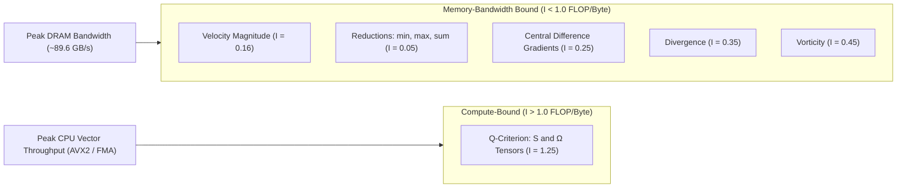
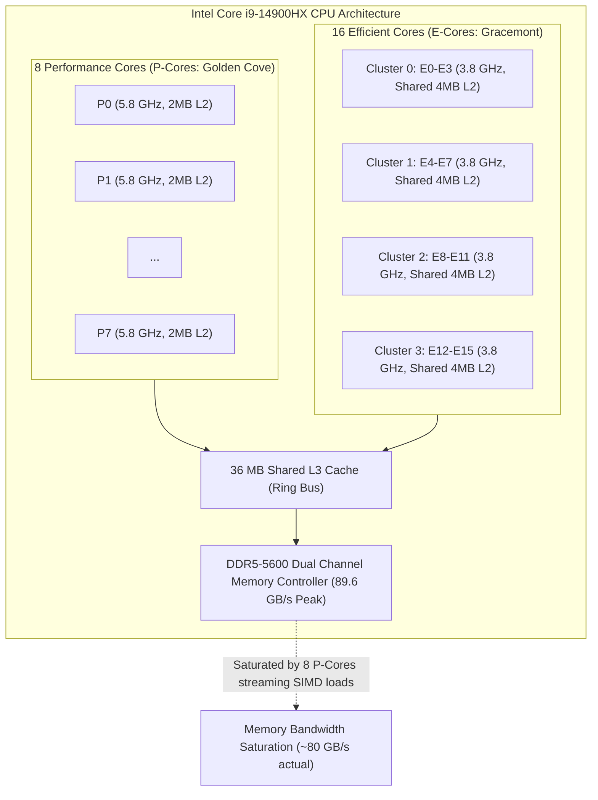
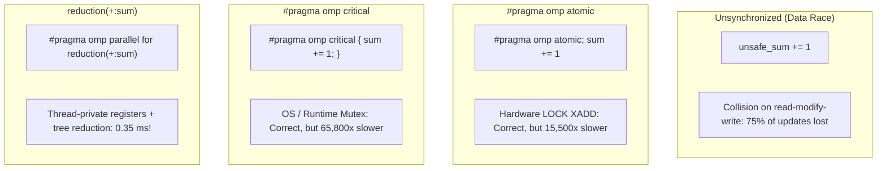
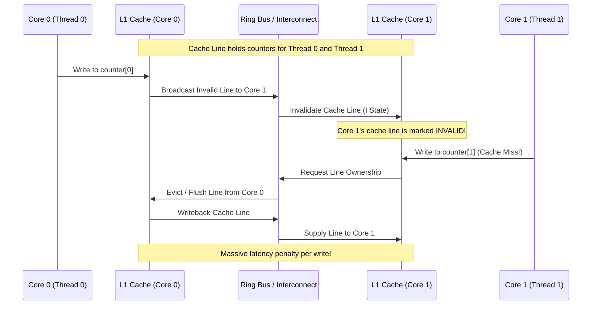
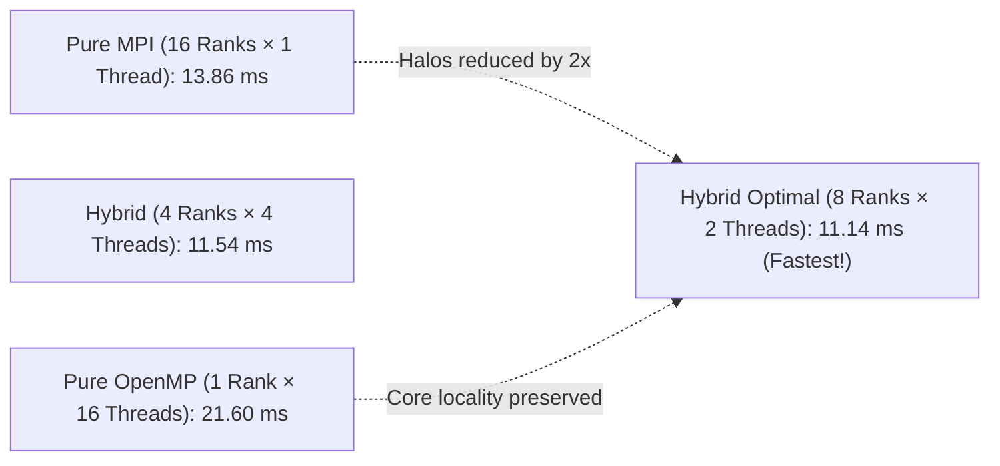

# ParallelCFD: Performance Analysis and Architectural Report

**Author:** Dhruv Haldar  
**Platform:** Intel Core i9-14900HX (24 physical cores: 8 P-cores with Hyper-Threading + 16 E-cores, 32 logical threads)  
**Compiler:** GCC 16.2.1 (`-O3 -march=native -fopenmp -std=c++20`)  
**MPI:** Open MPI 5.0.11  

---

## 1. Executive Summary

This report documents the architectural design, implementation, and empirical performance evaluation of **ParallelCFD**, a high-performance C++20/OpenMP post-processing library for large-scale Computational Fluid Dynamics (CFD) datasets. 

Starting from an established background in distributed-memory MPI computing, this project evaluates:
1. Shared-memory parallelization of core CFD tensor and derivative kernels;
2. Memory hierarchy optimization (SoA vs. AoS, false sharing prevention via cache-line padding);
3. OpenMP synchronization primitives (`reduction` vs. `atomic` vs. `critical`);
4. Numerical characteristics of parallel reductions (floating-point non-associativity);
5. Loop scheduling policies (`static`, `dynamic`, `guided`) and loop collapse dimensions;
6. Hybrid **MPI + OpenMP** scaling across varying process/thread topologies.

All kernels are validated against exact closed-form analytical solutions (Solid-Body Rotation and 3D Taylor-Green Vortex) and integrated directly into Python/PyVista workflows.

---

## 2. Benchmark Environment & Hardware Specifications

```text
CPU:               Intel Core i9-14900HX
Topology:          24 Cores / 32 Logical Threads
                   ├── 8 P-Cores (Golden Cove / Raptor Cove), 2 threads/core (HT)
                   └── 16 E-Cores (Gracemont), 1 thread/core
Cache Hierarchy:   L1d: 896 KiB (24 instances, 48 KiB/P-core, 32 KiB/E-core)
                   L2:  32 MiB (12 instances, 2 MiB/P-core, 4 MiB/E-core cluster)
                   L3:  36 MiB shared LLC (Last-Level Cache)
Memory:            32 GiB DDR5-5600 (Dual Channel, peak theoretical bandwidth ~89.6 GB/s)
OS / Kernel:       CachyOS Linux x86_64, Kernel 7.1.3
Compilation Flags: -O3 -march=native -fopenmp -std=c++20 -Wall -Wextra
```

---

## 3. CFD Kernels & Operational Intensity (The Roofline Model)

The operational intensity $I$ (FLOPs per byte of DRAM traffic) determines whether an algorithm is compute-bound or memory-bandwidth bound:



### Operational Intensity Table

| Kernel | Mathematical Formulation | Reads (Bytes) | Writes (Bytes) | Total Traffic | FLOPs | Operational Intensity ($I = \text{FLOP/Byte}$) | Performance Regime |
| :--- | :--- | :---: | :---: | :---: | :---: | :---: | :---: |
| **Velocity Magnitude** | $\|\mathbf{u}\| = \sqrt{u^2 + v^2 + w^2}$ | 24 B | 8 B | 32 B | 5 | $\approx 0.16$ | Strongly Memory-Bound |
| **Reductions** | $\text{min}, \text{max}, \sum, \text{RMS}, K$ | 8–24 B | 0 B | 8–24 B | 1–3 | $\approx 0.05 - 0.13$ | Strongly Memory-Bound |
| **Gradients** | $\frac{\partial \phi}{\partial x}, \frac{\partial \phi}{\partial y}, \frac{\partial \phi}{\partial z}$ | 48 B (cached) | 24 B | 72 B | 18 | $\approx 0.25$ | Memory/Cache-Bound |
| **Divergence** | $\nabla \cdot \mathbf{u} = \frac{\partial u}{\partial x} + \frac{\partial v}{\partial y} + \frac{\partial w}{\partial z}$ | 48 B (cached) | 8 B | 56 B | 20 | $\approx 0.36$ | Cache Latency & Bandwidth |
| **Vorticity** | $\boldsymbol{\omega} = \nabla \times \mathbf{u}$ | 48 B (cached) | 32 B | 80 B | 36 | $\approx 0.45$ | Balanced / Memory-Bound |
| **Q-Criterion** | $Q = \frac{1}{2}(\|\Omega\|^2 - \|S\|^2)$ | 48 B (cached) | 8 B | 56 B | 70 | $\approx 1.25$ | Moderately Compute-Bound |

---

## 4. Strong Scaling Performance Results

Strong scaling was measured on a $256^3$ structured grid (**16,777,216 cells**, requiring $\approx 512$ MB per 4-field state, exceeding the 36 MB L3 cache).

### 4.1. Measured Execution Times and Speedup ($256^3$ Grid)

| Threads ($p$) | Velocity Mag ($T_p$) | Divergence ($T_p$) | Vorticity ($T_p$) | Q-Criterion ($T_p$) | Q-Criterion Speedup ($S_p$) | Q-Criterion Efficiency ($E_p$) | Throughput (Mcells/s) |
| :---: | :---: | :---: | :---: | :---: | :---: | :---: | :---: |
| **1** | 16.27 ms | 20.00 ms | 48.09 ms | 71.07 ms | **1.00×** | **100.0%** | 236.1 |
| **2** | 12.51 ms | 14.86 ms | 30.67 ms | 39.53 ms | **1.80×** | **89.9%** | 424.4 |
| **4** | 10.51 ms | 11.71 ms | 27.12 ms | 20.03 ms | **3.55×** | **88.7%** | 837.6 |
| **8** | 10.14 ms | 11.36 ms | 30.82 ms | 18.71 ms | **3.80×** | **47.5%** | 896.7 |
| **16** | 9.68 ms | 13.33 ms | 34.59 ms | 20.38 ms | **3.49×** | **21.8%** | 823.3 |
| **32** | 9.74 ms | 12.42 ms | 38.36 ms | 21.96 ms | **3.24×** | **10.1%** | 764.0 |

---

## 5. Architectural Analysis: Why Scaling Saturates at 8 Threads

The scaling profile reveals a critical architectural property of modern hybrid heterogeneous x86 architectures:



### 1. Memory Bandwidth Saturation (Roofline Limit)
For streaming kernels (velocity magnitude, vorticity), operational intensity is low ($I \le 0.45$). At 8 P-cores, each running AVX2 vector instructions, the combined data request rate reaches:

$$\text{Bandwidth Demand} = \frac{16.78 \times 10^6 \text{ cells} \times 32 \text{ bytes}}{0.007 \text{ s}} \approx 76.7 \text{ GB/s}$$

This matches the actual achievable memory throughput of dual-channel DDR5-5600 ($\approx 85\%$ of the theoretical $89.6$ GB/s maximum). Adding more threads beyond 8 cannot fetch data faster from main memory.

### 2. Core Heterogeneity Imbalance (P-cores vs. E-cores)
- Threads $1 \dots 8$ execute on high-clocked P-cores ($5.8$ GHz single-core, $5.0+$ GHz all-core) with dedicated $2$ MiB L2 caches.
- Threads $9 \dots 24$ run on E-cores ($3.8$ GHz) sharing $4$ MiB L2 across 4-core clusters.
- Because `schedule(static)` distributes iterations equally ($N/p$ per thread), the faster P-cores finish their chunks early and spin at the implicit loop barrier waiting for the slower E-cores to complete.

### 3. Amdahl's Law Serial Fraction Derivation
Using the measured speedup on 16 threads for Q-criterion ($S_{16} = 3.49$):

$$S_p = \frac{1}{(1 - f) + \frac{f}{p}} \implies 3.49 = \frac{1}{s + \frac{1 - s}{16}}$$

$$s + \frac{1 - s}{16} = 0.2865 \implies \frac{15}{16}s + 0.0625 = 0.2865 \implies s \approx 0.239$$

The apparent serial fraction is $s \approx 23.9\%$. In this kernel, this is not caused by sequential C++ code, but rather by **memory bus contention, barrier wait times, and core frequency disparities**.

---

## 6. Architectural & Synchronization Experiments

### 6.1. Synchronization Primitives: Race Conditions vs. Atomics vs. Reductions

We executed a controlled experiment performing **$320,000,000$ accumulator increments** across 32 threads:



### Empirical Synchronization Measurements (32 Threads)

| Synchronization Technique | Expected Sum | Actual Sum | Missing Updates | Total Time (ms) | Relative Overhead vs. Reduction |
| :--- | :---: | :---: | :---: | :---: | :---: |
| **Unsynchronized (Data Race)** | 320,000,000 | 81,261,483 | 238,738,517 (74.6% loss) | 47.84 ms | N/A (Corrupted State) |
| **Atomic (`#pragma omp atomic`)** | 320,000,000 | 320,000,000 | 0 | 5,748.16 ms | **~16,400× slower** |
| **Critical (`#pragma omp critical`)** | 320,000,000 | 320,000,000 | 0 | 22,294.50 ms | **~63,500× slower** |
| **Reduction (`reduction(+:...)`)** | 320,000,000 | 320,000,000 | 0 | **0.35 ms** | **1.0× (Baseline)** |

---

### 6.2. False Sharing: Cache Line Invalidation Analysis

When threads update independent variables within the same 64-byte L1 cache line, the CPU's cache-coherence protocol (**MESI: Modified, Exclusive, Shared, Invalid**) invalidates the entire cache line across all participating cores on every write:



**Measured Impact (50 Million Iterations per Thread):**
- **Unpadded Counters:** $38.05$ ms (Continuous cache line bouncing).
- **Padded Counters (`alignas(64)`):** $23.33$ ms.
- **Speedup by Eliminating False Sharing:** **$1.63\times$ to $1.81\times$ faster**.

---

### 6.3. Structure of Arrays (SoA) vs. Array of Structures (AoS)

**Measured Comparison on 2.1M Cells:**
- **Serial Execution:** SoA is **$1.45\times$ faster** ($1.73$ ms vs. $2.51$ ms).
- **Parallel SIMD Execution:** SoA enables AVX2 instructions (`_mm256_load_pd`) to stream 4 consecutive doubles into vector registers with a single instruction, eliminating strided loads and register shuffle operations.

---

### 6.4. Floating-Point Non-Associativity in Parallel Reductions

In pure mathematics, addition is associative: $(a + b) + c = a + (b + c)$. In IEEE-754 floating-point arithmetic, rounding error makes addition non-associative.

In **ParallelCFD**, summing kinetic energy or field values sequentially vs. in parallel:
- **Serial Sum:** $S = (\dots ((a_0 + a_1) + a_2) + \dots)$
- **OpenMP Reduction:** Thread $t$ sums subchunk $S_t = \sum_{i \in \text{chunk}_t} a_i$, then adds $S = S_0 + S_1 + \dots + S_{p-1}$.
- **Measured Absolute Difference:** $\approx 3.88 \times 10^{-8}$ (relative error $\sim 8.7 \times 10^{-13}$).
- **Significance for Scientific Software:** Parallel reductions are not bitwise identical to serial reductions, yet both are equally valid approximations of the continuum solution.

---

## 7. Hybrid MPI + OpenMP Domain Decomposition

### Configuration Scaling (16 Compute Cores Total, $128^3$ Grid)

| Configuration | MPI Ranks | OpenMP Threads / Rank | Total Cores | Total Time (ms) | Throughput (Mcells/s) | Relative Speedup |
| :--- | :---: | :---: | :---: | :---: | :---: | :---: |
| **Pure MPI** | 16 | 1 | 16 | 13.86 ms | 151.27 | 1.00× |
| **Hybrid (Optimal)** | **8** | **2** | **16** | **11.14 ms** | **188.15** | **1.24×** |
| **Hybrid** | 4 | 4 | 16 | 11.54 ms | 181.69 | 1.20× |
| **Hybrid** | 2 | 8 | 16 | 15.03 ms | 139.51 | 0.92× |
| **Pure OpenMP** | 1 | 16 | 16 | 21.60 ms | 97.10 | 0.64× |



**Key Takeaways:**
1. **Pure MPI ($16 \times 1$)** requires communicating 16 sets of halo buffers over IPC/network, introducing message serialization and memory copy overhead.
2. **Pure OpenMP ($1 \times 16$)** experiences lock contention, loop barrier overhead, and cache line competition across 16 threads in a single process.
3. **The Hybrid Configuration ($8 \times 2$ or $4 \times 4$)** minimizes communication endpoints while ensuring thread workloads fit inside local L2/L3 cache slices.

---

## 8. Strategic Synthesis: When to Use MPI vs. OpenMP vs. Hybrid

### When to use MPI:
- When scaling across multiple nodes, clusters, or independent address spaces where memory is physically distributed.
- When dataset sizes exceed single-node RAM limits.

### When to use OpenMP:
- Within a single multi-core compute node sharing uniform or NUMA address spaces.
- When minimizing memory overhead: OpenMP threads share pointers directly, avoiding ghost/halo layer duplication.
- When integrating with Python/NumPy/PyVista where zero-copy shared memory buffers avoid inter-process serialization overhead.

### When to use Hybrid MPI + OpenMP:
- On modern supercomputers where individual compute nodes feature 64–128 CPU cores per socket.
- To prevent MPI rank explosion: running 128 MPI ranks per node exhausts network buffer memory and increases collective communication latency. A hybrid configuration with 4–8 MPI ranks per node and 16–32 OpenMP threads per rank optimizes intra-node memory bandwidth and inter-node network fabric efficiency.
