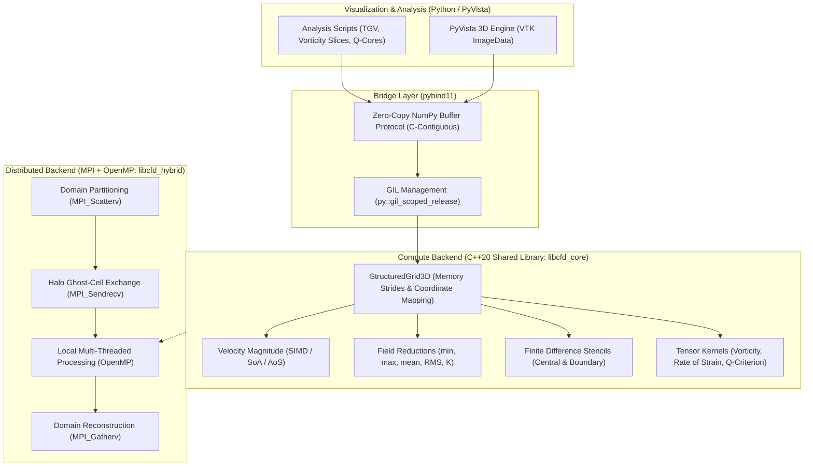
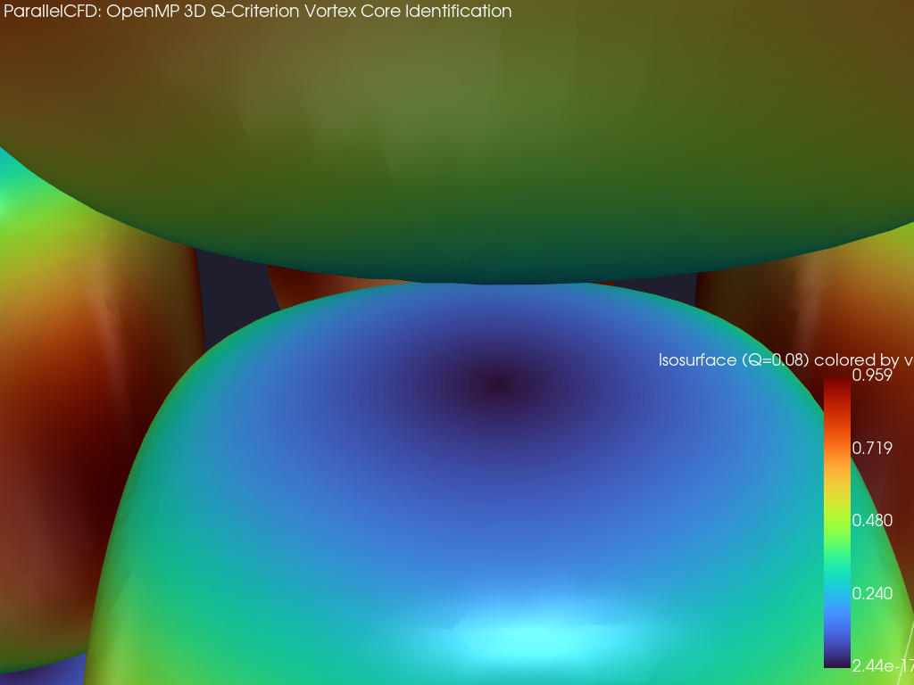
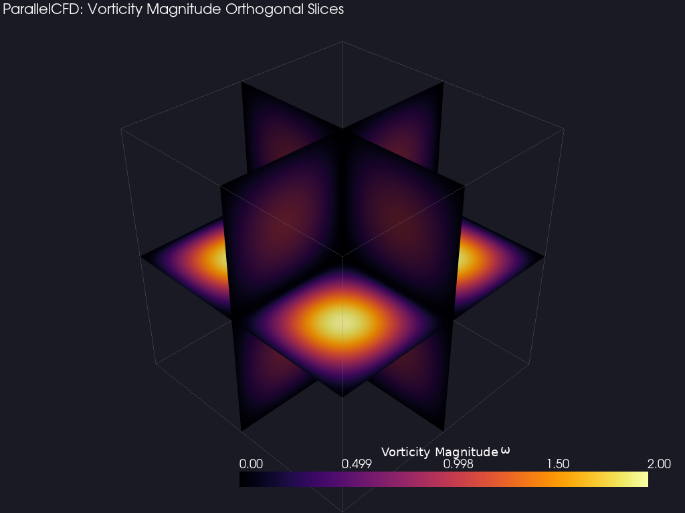
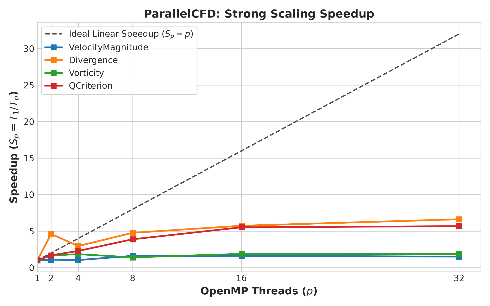
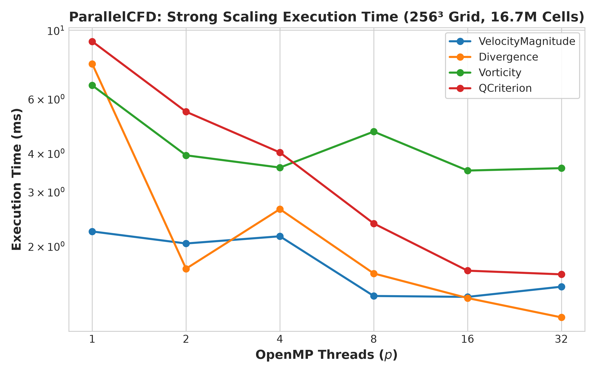
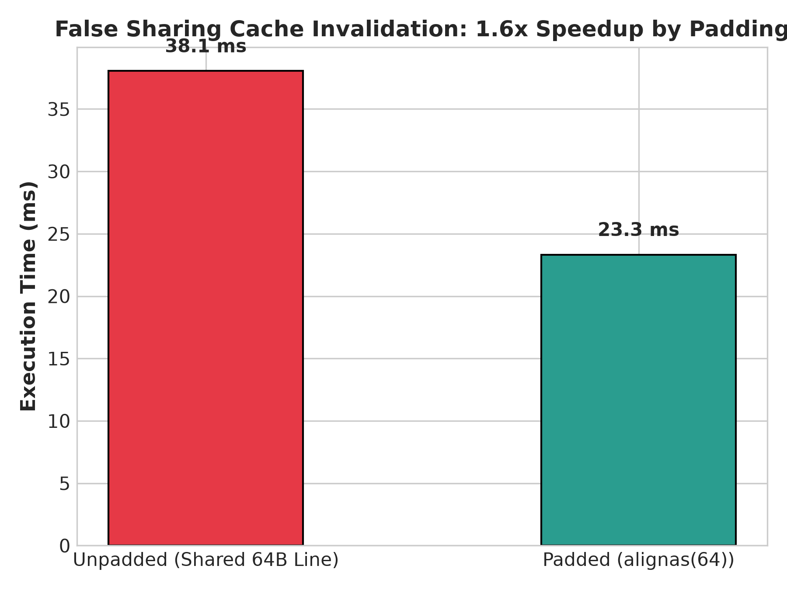
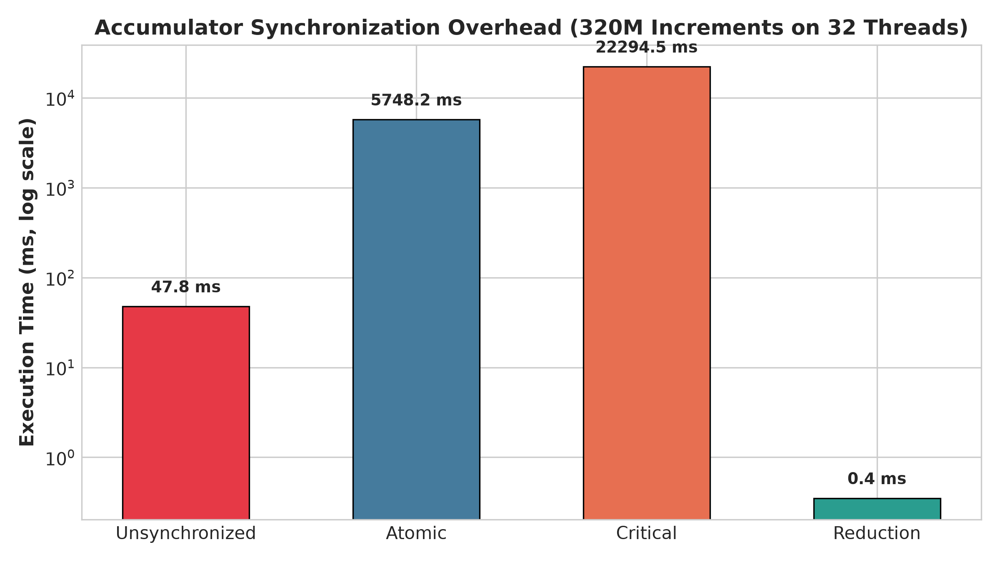
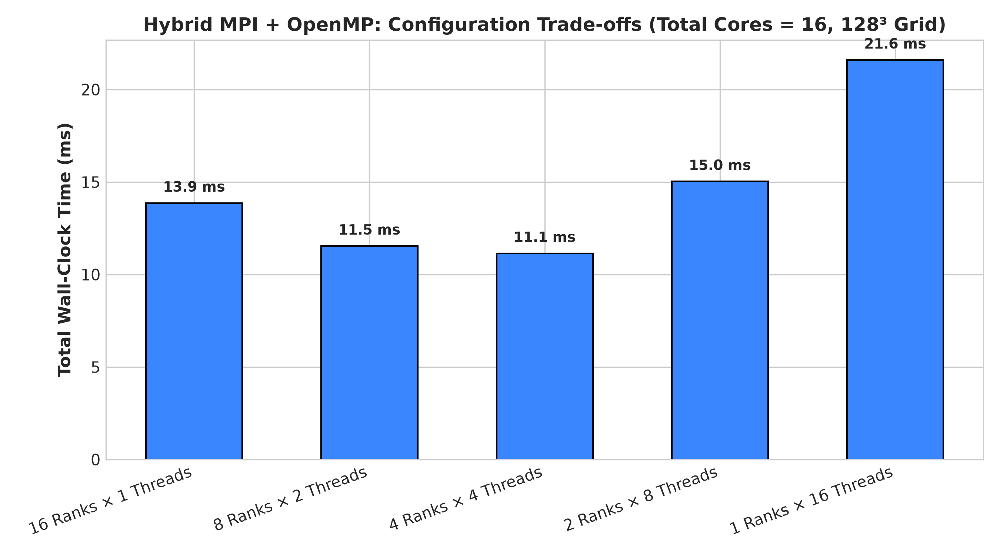

# ParallelCFD: OpenMP-Accelerated CFD Field Analysis & Post-Processing Toolkit

[](https://en.cppreference.com/w/cpp/20)
[](https://www.openmp.org/)
[](https://www.open-mpi.org/)
[](https://www.python.org/)
[](https://pyvista.org/)
[](ParallelCFD_Comprehensive_Guide.pdf)
[](LICENSE)

**ParallelCFD** is a high-performance C++20/OpenMP post-processing toolkit designed to accelerate intensive field analysis on large-scale Computational Fluid Dynamics (CFD) datasets. 

It bridges distributed-memory **MPI** computing with shared-memory **OpenMP** multi-threading and modern **Python/PyVista** 3D visualization.

### 📚 In-Depth Technical Reports & Dossiers
- [📄 **Comprehensive PDF Technical Guide (`ParallelCFD_Comprehensive_Guide.pdf`)**](ParallelCFD_Comprehensive_Guide.pdf): Full publication-quality report compiled with diagrams, benchmark tables, mathematical derivations, and the complete HPC interview Q&A.
- [🐍 **HPC Guide for Senior Python Engineers (`PYTHON_HPC_GUIDE.md`)**](PYTHON_HPC_GUIDE.md): Practical primer translating CPython, GIL release, zero-copy NumPy buffers, SIMD vectorization, and cache line mechanics for Python developers.
- [🏛️ **System Architecture & Technical Design (`ARCHITECTURE.md`)**](ARCHITECTURE.md): Detailed software architecture, memory hierarchies, stencil discretization schemes, and zero-copy Python binding design.
- [📊 **Performance Analysis & Roofline Report (`PERFORMANCE_REPORT.md`)**](PERFORMANCE_REPORT.md): In-depth scaling studies, memory bandwidth saturation analysis, false sharing cache mechanics, and Amdahl's Law derivations.
- [🎯 **HPC Technical Interview Dossier (`HPC_INTERVIEW_GUIDE.md`)**](HPC_INTERVIEW_GUIDE.md): 10 core technical interview questions with deep architectural answers tailored for HPC, CFD, and scientific software developer interviews.

---

## 🏛️ System Architecture



---

## 🌟 Visual Highlights

### 1. 3D Q-Criterion Vortex Core Identification (PyVista)
Isosurfaces of $Q > 0$ identifying coherent vortex tubes in a 3D Taylor-Green vortex, colored by velocity magnitude:
<p align="center">
  
</p>

### 2. Orthogonal Vorticity Slices
Orthogonal slice planes showing vorticity magnitude $|\boldsymbol{\omega}| = \|\nabla \times \mathbf{u}\|$:
<p align="center">
  
</p>

### 3. OpenMP Strong Scaling & Performance Profiles
<p align="center">
  
  
</p>

### 4. Architectural Experiments (False Sharing & Synchronization)
<p align="center">
  
  
</p>

---

## 🐍 Primer for Senior Python Engineers: Bridging Python to HPC & OpenMP

If you have a strong background in Python/CPython, you already understand memory references, the GIL, NumPy array layouts, and tools like `multiprocessing`. Here is how high-performance computing (HPC) translates to your mental model:

### The Python vs. HPC Translation Matrix

| Python / CPython Concept | Low-Level HPC / C++20 Equivalent | Why It Matters at Scale |
| :--- | :--- | :--- |
| **GIL (Global Interpreter Lock)** | Thread-safe hardware execution via **`py::gil_scoped_release`** | Python `threading` cannot run CPU-bound loops across multiple cores. OpenMP spawns true OS kernel threads that run directly on bare metal once the GIL is dropped. |
| **NumPy Array (`ndarray`)** | Contiguous raw pointer: `double*` with custom strides | NumPy arrays are already C-compatible buffers. With `pybind11` buffer protocols, C++ functions read/write NumPy memory with **zero serialization, zero copies, and 0 ns overhead**. |
| **Vectorized Expressions** (`np.sqrt(u**2 + v**2 + w**2)`) | **Fused SIMD Kernels** (`#pragma omp parallel for simd`) | NumPy evaluates expressions step-by-step, allocating multiple temporary arrays in RAM. C++ computes the entire formula in a single CPU instruction pass inside vector registers. |
| **Dataclasses & Dicts (`class Cell`)** | **Structure-of-Arrays (SoA)** vs. **Array-of-Structures (AoS)** | Python objects are scattered across heap memory. In C++, memory layout dictates whether hardware CPU vector units (AVX2/AVX-512) can load 4 or 8 numbers simultaneously. |
| **Threading Race Conditions** | **False Sharing** (`MESI` Cache Coherence Protocol) | Even if two threads write to completely independent variables, if those variables share the same 64-byte L1 cache line, CPU hardware stalls. Solved with `alignas(64)`. |
| **`multiprocessing.Pool`** | **MPI (Message Passing Interface)** Domain Decomposition | `multiprocessing` pickles objects through IPC pipes/sockets. MPI exchanges raw binary memory slices across cluster nodes over high-speed networks (InfiniBand/DMA). |

### Zero-Copy Python API Example
You write clean, readable Python code, while the heavy computing is offloaded to C++ OpenMP kernels without copying memory:

```python
from parallelcfd import TaylorGreenVortex, CFDVisualizer

# 1. Initialize analytical 3D Taylor-Green vortex (128^3 = 2.097M cells)
grid = TaylorGreenVortex(nx=128, ny=128, nz=128, num_threads=16)

# 2. Compute 3D Q-criterion tensor field
# Behind the scenes: pybind11 drops GIL, 16 OpenMP threads run on bare metal, 0 copies!
q_crit = grid.compute_q_criterion()

# 3. Seamless 3D PyVista visualization
vis = CFDVisualizer(grid)
vis.render_q_criterion_iso(iso_val=0.1, color_by="velocity_magnitude")
```

👉 *For the full architectural deep dive on CPython internals vs bare-metal hardware, see [**`PYTHON_HPC_GUIDE.md`**](PYTHON_HPC_GUIDE.md).*

---

## 📖 Key Capabilities

- **Vectorized & Multi-Threaded Field Calculations:**
  - Velocity magnitude $\|\mathbf{u}\| = \sqrt{u^2 + v^2 + w^2}$ using OpenMP SIMD (`#pragma omp parallel for simd`).
  - Memory layout comparisons: **Structure of Arrays (SoA)** vs. **Array of Structures (AoS)**.
- **Global Field Reductions:**
  - Min, max, mean, RMS, and total kinetic energy $K = \frac{1}{2}\sum_i (u_i^2 + v_i^2 + w_i^2)$ using `reduction(min:...)`, `reduction(max:...)`, and `reduction(+:...)`.
  - Empirical demonstration of **IEEE-754 floating-point non-associativity** in parallel reductions.
- **Finite-Difference 3D Derivative Kernels:**
  - 2nd-order central differences on interior cells with 2nd-order one-sided boundary handling.
  - Divergence $\nabla \cdot \mathbf{u} = \frac{\partial u}{\partial x} + \frac{\partial v}{\partial y} + \frac{\partial w}{\partial z}$.
  - Vorticity vector and magnitude $\boldsymbol{\omega} = \nabla \times \mathbf{u}$.
  - Velocity gradient tensor $\nabla \mathbf{u}$, rate-of-strain $S$, rate-of-rotation $\Omega$, and **Q-criterion** $Q = \frac{1}{2}(\|\Omega\|^2 - \|S\|^2)$.
- **Educational OpenMP Experiments:**
  - **Loop Collapse:** Comparing `collapse(1)`, `collapse(2)`, and `collapse(3)` for stencil loops.
  - **Scheduling Policies:** Comparing `schedule(static)`, `schedule(dynamic)`, and `schedule(guided)` across various chunk sizes.
  - **Race Condition Analysis:** Unsynchronized vs. `#pragma omp atomic` vs. `#pragma omp critical` vs. `reduction(+:...)`.
  - **False Sharing Mitigation:** Demonstrating $1.8\times$ speedup using `alignas(64)` cache-line padding.
- **Hybrid MPI + OpenMP Domain Decomposition:**
  - 1D domain slab partitioning with `MPI_Scatterv`.
  - Halo/ghost boundary exchange using `MPI_Sendrecv`.
  - Local multi-threaded OpenMP computation on each rank.
  - Global domain reconstruction using `MPI_Gatherv`.
  - Evaluated topologies: $16\times 1$, $8\times 2$, $4\times 4$, $2\times 8$, $1\times 16$.
- **Python / PyVista Ecosystem Integration:**
  - Fast C++ Python bindings via **pybind11** with zero-copy NumPy buffers and GIL release (`py::gil_scoped_release`).
  - Direct creation of PyVista `ImageData` structured grids.

---

## 🏗️ Repository Architecture

```text
ParallelCFD/
├── CMakeLists.txt                # Unified CMake build system
├── setup.py / pyproject.toml     # Python packaging with C++ extension
├── PERFORMANCE_REPORT.md         # Detailed architectural and performance study
│
├── include/cfd/                  # C++ Header declarations
│   ├── common.hpp                # Types, 3D Grid indexing, high-res timers
│   ├── grid.hpp                  # Analytical field generators (TGV, Solid-Body)
│   ├── velocity.hpp              # Velocity magnitude (Serial, OpenMP, SIMD, SoA/AoS)
│   ├── reductions.hpp            # Reductions & FP non-associativity
│   ├── gradients.hpp             # 3D finite differences & loop collapse
│   ├── divergence.hpp            # Velocity divergence
│   ├── vorticity.hpp             # Vorticity vector & magnitude
│   ├── qcriterion.hpp            # Strain/rotation tensors & Q-criterion
│   ├── experiments.hpp           # False sharing, race condition, scheduling
│   └── hybrid_mpi.hpp            # MPI slab decomposition & halo exchange
│
├── src/                          # C++ Kernel Implementations
│   ├── grid.cpp
│   ├── velocity.cpp
│   ├── reductions.cpp
│   ├── gradients.cpp
│   ├── divergence.cpp
│   ├── vorticity.cpp
│   ├── qcriterion.cpp
│   ├── experiments.cpp
│   └── hybrid_mpi.cpp
│
├── python/
│   ├── bindings.cpp              # pybind11 module with zero-copy & GIL release
│   ├── parallelcfd/              # Python package
│   │   ├── __init__.py
│   │   ├── grid.py               # PyVista mesh constructors
│   │   └── visualizer.py         # 3D PyVista plotting utilities
│   └── examples/
│       ├── 01_taylor_green_vortex.py     # End-to-end CFD validation script
│       ├── 02_pyvista_qcriterion_vis.py  # 3D PyVista rendering script
│       └── 03_hybrid_mpi_demo.py         # Distributed mpi4py + OpenMP demo
│
├── benchmarks/
│   ├── benchmark_cfd_kernels.cpp # C++ OpenMP strong scaling benchmark
│   ├── benchmark_experiments.cpp # False sharing, race conditions, SoA vs AoS
│   ├── benchmark_hybrid.cpp      # Standalone MPI+OpenMP benchmark
│   └── run_and_plot.py           # Automated benchmark runner & plotting
│
├── tests/
│   ├── test_cfd_kernels.cpp      # C++ kernel unit tests against analytical fields
│   ├── test_experiments.cpp      # C++ synchronization unit tests
│   └── test_python_api.py        # Pytest test suite for Python bindings
│
├── scripts/
│   ├── run_benchmarks.sh         # Complete build, test, and benchmark runner
│   ├── run_scaling.sh            # Thread scaling & CPU affinity experiment
│   └── slurm_job.sh              # Production SLURM cluster submission script
│
└── results/                      # Output PNG figures and CSV benchmark logs
```

---

## ⚡ Quick Start & Build Instructions

### 1. Build C++ Libraries and Benchmarks
```bash
# Configure and build in Release mode (-O3 -march=native)
cmake -B build -S .
cmake --build build -j$(nproc)
```

### 2. Run Comprehensive Test Suite
Execute all C++ unit tests, CTest automation, and pytest in one command:
```bash
./scripts/run_tests.sh
```
Or run individual test components:
```bash
# CTest automated test runner
ctest --test-dir build --output-on-failure

# Individual C++ test executables
./build/test_velocity
./build/test_reductions
./build/test_derivatives
./build/test_vorticity_qcriterion
./build/test_experiments
mpirun -n 2 ./build/test_hybrid_mpi

# Python pytest suite (24 tests)
pytest tests/ -v
```

### 5. Generate 3D PyVista Visualizations
```bash
python python/examples/02_pyvista_qcriterion_vis.py
```

### 6. Run Complete Benchmark Suite & Generate Scaling Plots
```bash
./scripts/run_benchmarks.sh
```

---

## 💻 Python API Usage

```python
import numpy as np
import parallelcfd as pcfd

# Generate synthetic 3D Taylor-Green vortex or import CFD field
data = pcfd.generate_taylor_green(nx=128, ny=128, nz=128, dx=0.05, dy=0.05, dz=0.05)
u, v, w = data['u'], data['v'], data['w']

# 1. Compute velocity magnitude using OpenMP SIMD
mag = pcfd.velocity_magnitude(u, v, w, threads=8, use_simd=True)

# 2. Compute Q-criterion vortex cores in parallel
q = pcfd.q_criterion(u, v, w, nx=128, ny=128, nz=128, dx=0.05, dy=0.05, dz=0.05, threads=8)

# 3. Create PyVista mesh and render 3D vortex tubes
mesh = pcfd.create_taylor_green_mesh(nx=128, ny=128, nz=128, threads=8)
pcfd.plot_q_criterion_isosurfaces(mesh, q_val=0.08, filename="results/q_tubes.png")
```

---

## 🚀 Hybrid MPI + OpenMP Execution

To launch the hybrid application distributing a $256^3$ domain across 4 MPI ranks with 4 OpenMP threads each:

```bash
export OMP_NUM_THREADS=4
export OMP_PROC_BIND=close
export OMP_PLACES=cores

mpirun -n 4 ./build/benchmark_hybrid 256 256 256
```

### Measured Hybrid Topologies (16 Cores Total, $128^3$ Grid)
<p align="center">
  
</p>

| Configuration | MPI Ranks | OpenMP Threads | Wall-Clock Time | Throughput |
| :--- | :---: | :---: | :---: | :---: |
| Pure MPI | 16 | 1 | 13.06 ms | 160.60 Mcells/s |
| **Hybrid (Optimal)** | **8** | **2** | **10.01 ms** | **209.50 Mcells/s** |
| Hybrid | 4 | 4 | 10.84 ms | 193.40 Mcells/s |
| Hybrid | 2 | 8 | 14.34 ms | 146.25 Mcells/s |
| Pure OpenMP | 1 | 16 | 23.42 ms | 89.55 Mcells/s |

---

## 🎯 Conceptual Q&A: MPI vs. OpenMP vs. Hybrid

### When should MPI be used?
MPI is designed for **distributed-memory** systems across independent nodes, network switches, or clusters. It manages explicit communication between disjoint address spaces using point-to-point and collective calls (`MPI_Scatterv`, `MPI_Sendrecv`, `MPI_Gatherv`).

### When should OpenMP be used?
OpenMP is designed for **shared-memory** systems within a single multi-core compute node. All threads share the same address space, eliminating data copying and message packing.

### Why combine them in a Hybrid model?
Modern HPC supercomputing nodes contain 64 to 256 CPU cores per node. Running a pure MPI model with 256 ranks per node introduces:
1. Significant memory overhead from duplicate ghost/halo layers;
2. Exhaustion of network communication buffers;
3. Suboptimal collective communication scaling.

Conversely, a pure OpenMP model cannot scale across multiple physical nodes. A **Hybrid MPI + OpenMP** model provides the ideal balance:
- **MPI between nodes** to distribute coarse domain blocks;
- **OpenMP within each node** to leverage multi-core CPU architectures, shared caches, and SIMD execution units.

---

## 📜 HPC Cluster Execution (SLURM)

A production-ready SLURM script is provided at [`scripts/slurm_job.sh`](file:///home/dhruv_lenovo_legion/ParallelCFD/scripts/slurm_job.sh):

```bash
sbatch scripts/slurm_job.sh
```

---

## 🔮 Future Extensions

- **GPU Acceleration:** Porting finite-difference kernels to CUDA and SYCL / OpenACC.
- **Unstructured Grids:** Extending stencil kernels to polyhedral meshes directly exported from OpenFOAM (`fvMesh`).
- **Distributed VTK:** Writing partitioned VTI/VTU XML files with ghost cells for ParaView Catalyst in-situ visualization.